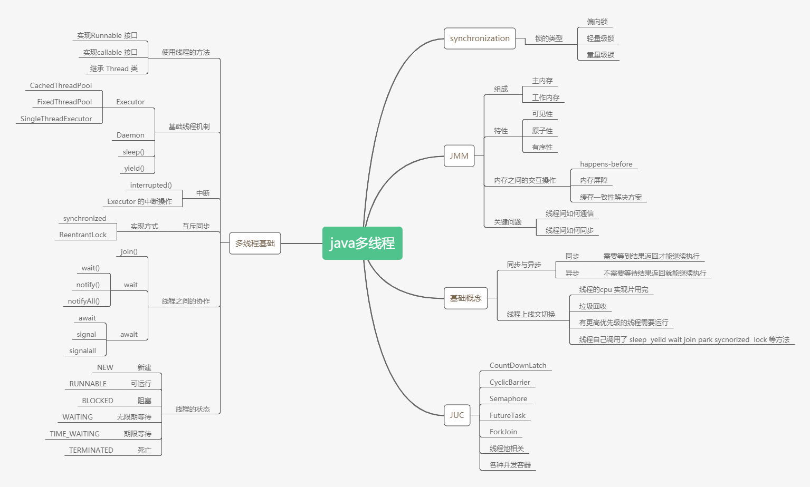

# 作业
---
- 启动一个新线程，运行一个方法，拿到这个方法的返回值后，退出主线程
- 使用Junit，用单元测试的方式运行，复用after输出结果

代码如下：
 ```java
package pers.ryan.thread;

import lombok.extern.slf4j.Slf4j;
import org.junit.After;
import org.junit.Assert;
import org.junit.Before;
import org.junit.Test;

import java.util.concurrent.*;
import java.util.concurrent.locks.Condition;
import java.util.concurrent.locks.Lock;
import java.util.concurrent.locks.ReentrantLock;


@Slf4j
public class GetResultTest {

    private static final long FIBONACCI_41 = 267914296;
    private static long start = 0;

    private String methodName;
    private int result;

    @Before
    public void init() {
        result = 0;
        start = System.currentTimeMillis();
    }

    @After
    public void after() {
        log.info("method: {}, time consumed: {}", methodName, System.currentTimeMillis() - start);
        log.info("result: {}", result);
        log.info("");
        Assert.assertEquals(FIBONACCI_41, result);
    }

    @Test
    public void useWhile() throws InterruptedException {
        methodName = getMethodName();
        new Thread(() -> {
            result = FibUtil.fib41();
        }).start();

        while (result == 0) {
            TimeUnit.MILLISECONDS.sleep(1);
        }
    }

    @Test
    public void useJoin() throws InterruptedException {
        methodName = getMethodName();
        Thread thread = new Thread(() -> result = FibUtil.fib41());
        thread.start();
        thread.join();
    }

    /**
     * 确保子线程先拿到锁
     */
    @Test
    public void useSynchronized() throws InterruptedException {
        methodName = getMethodName();
        new Thread(() -> {
            synchronized (this) {
                result = FibUtil.fib41();
            }
        }).start();

        TimeUnit.MILLISECONDS.sleep(500);
        synchronized (this) {
        }
    }

    /**
     * 确保主线程先拿到锁
     */
    @Test
    public void useWaitNotify() throws InterruptedException {
        methodName = getMethodName();
        new Thread(() -> {
            try {
                TimeUnit.MILLISECONDS.sleep(100);
            } catch (InterruptedException e) {
                e.printStackTrace();
            }
            synchronized (this) {
                result = FibUtil.fib41();
                notifyAll();
            }
        }).start();

        synchronized (this) {
            wait();
        }
    }

    /**
     * 确保子线程先拿到锁
     */
    @Test
    public void useLock() throws InterruptedException {
        methodName = getMethodName();
        final Lock lock = new ReentrantLock();
        new Thread(() -> {
            try {
                lock.lock();
                result = FibUtil.fib41();
            } finally {
                lock.unlock();
            }
        }).start();

        TimeUnit.MILLISECONDS.sleep(500);
        try {
            lock.lock();
        } finally {
            lock.unlock();
        }
    }

    /**
     * 确保主线程先拿到锁
     */
    @Test
    public void useLockAndCondition() throws InterruptedException {
        methodName = getMethodName();
        Lock lock = new ReentrantLock();
        Condition condition = lock.newCondition();
        new Thread(() -> {
            try {
                TimeUnit.MILLISECONDS.sleep(100);
                lock.lock();
                result = FibUtil.fib41();
                condition.signalAll();
            } catch (Exception e) {
                e.printStackTrace();
            } finally {
                lock.unlock();
            }
        }).start();

        try {
            lock.lock();
            condition.await();
        } finally {
            lock.unlock();
        }
    }

    /**
     * 类似可以采用CyclicBarrier
     */
    @Test
    public void useCountDownLatch() throws InterruptedException {
        methodName = getMethodName();
        CountDownLatch countDownLatch = new CountDownLatch(1);
        new Thread(() -> {
            result = FibUtil.fib41();
            countDownLatch.countDown();
        }).start();
        countDownLatch.await();
    }

    @Test
    public void useFutureTask() throws ExecutionException, InterruptedException {
        methodName = getMethodName();
        FutureTask<Integer> task = new FutureTask<>(FibUtil::fib41);
        new Thread(task).start();
        result = task.get();
    }

    @Test
    public void useTreadPoolAndFuture() throws ExecutionException, InterruptedException {
        methodName = getMethodName();
        ExecutorService executorService = Executors.newCachedThreadPool();
        Future<Integer> future = executorService.submit(FibUtil::fib41);
        executorService.shutdown();
        result = future.get();
    }

    @Test
    public void useCompletableFuture() throws ExecutionException, InterruptedException {
        methodName = getMethodName();
        result = CompletableFuture.supplyAsync(FibUtil::fib41).get();
    }

    /**
     * 生产-消费模型
     */
    @Test
    public void useBlockingQueue() throws InterruptedException {
        methodName = getMethodName();
        BlockingQueue<Integer> blockingQueue = new LinkedBlockingQueue<>();
        new Thread(() -> {
            int result = FibUtil.fib41();
            try {
                blockingQueue.put(result);
            } catch (InterruptedException e) {
                e.printStackTrace();
            }
        }, getMethodName()).start();
        result = blockingQueue.take();
    }

    private String getMethodName() {
        return Thread.currentThread().getStackTrace()[2].getMethodName();
    }
}

 ```

执行结果：
 ```
03:43:44.298 [main] INFO pers.ryan.thread.GetResultTest - method: useWaitNotify, time consumed: 1070
03:43:44.304 [main] INFO pers.ryan.thread.GetResultTest - result: 267914296
03:43:44.304 [main] INFO pers.ryan.thread.GetResultTest - 
03:43:45.191 [main] INFO pers.ryan.thread.GetResultTest - method: useTreadPoolAndFuture, time consumed: 885
03:43:45.191 [main] INFO pers.ryan.thread.GetResultTest - result: 267914296
03:43:45.191 [main] INFO pers.ryan.thread.GetResultTest - 
03:43:46.086 [main] INFO pers.ryan.thread.GetResultTest - method: useLockAndCondition, time consumed: 894
03:43:46.086 [main] INFO pers.ryan.thread.GetResultTest - result: 267914296
03:43:46.086 [main] INFO pers.ryan.thread.GetResultTest - 
03:43:46.906 [main] INFO pers.ryan.thread.GetResultTest - method: useFutureTask, time consumed: 819
03:43:46.907 [main] INFO pers.ryan.thread.GetResultTest - result: 267914296
03:43:46.907 [main] INFO pers.ryan.thread.GetResultTest - 
03:43:47.752 [main] INFO pers.ryan.thread.GetResultTest - method: useWhile, time consumed: 845
03:43:47.752 [main] INFO pers.ryan.thread.GetResultTest - result: 267914296
03:43:47.752 [main] INFO pers.ryan.thread.GetResultTest - 
03:43:48.770 [main] INFO pers.ryan.thread.GetResultTest - method: useJoin, time consumed: 1018
03:43:48.771 [main] INFO pers.ryan.thread.GetResultTest - result: 267914296
03:43:48.771 [main] INFO pers.ryan.thread.GetResultTest - 
03:43:49.579 [main] INFO pers.ryan.thread.GetResultTest - method: useLock, time consumed: 808
03:43:49.579 [main] INFO pers.ryan.thread.GetResultTest - result: 267914296
03:43:49.579 [main] INFO pers.ryan.thread.GetResultTest - 
03:43:50.363 [main] INFO pers.ryan.thread.GetResultTest - method: useCountDownLatch, time consumed: 783
03:43:50.363 [main] INFO pers.ryan.thread.GetResultTest - result: 267914296
03:43:50.363 [main] INFO pers.ryan.thread.GetResultTest - 
03:43:51.133 [main] INFO pers.ryan.thread.GetResultTest - method: useSynchronized, time consumed: 770
03:43:51.133 [main] INFO pers.ryan.thread.GetResultTest - result: 267914296
03:43:51.133 [main] INFO pers.ryan.thread.GetResultTest - 
03:43:51.916 [main] INFO pers.ryan.thread.GetResultTest - method: useBlockingQueue, time consumed: 782
03:43:51.916 [main] INFO pers.ryan.thread.GetResultTest - result: 267914296
03:43:51.916 [main] INFO pers.ryan.thread.GetResultTest - 
03:43:52.726 [main] INFO pers.ryan.thread.GetResultTest - method: useCompletableFuture, time consumed: 809
03:43:52.727 [main] INFO pers.ryan.thread.GetResultTest - result: 267914296
 ```
---
## 多线程和并发相关知识脑图
